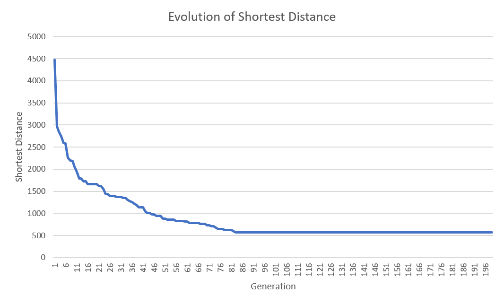

# Travelling Salesman Problem
Implementation of a Genetic Algorithm using Clojure. See the literate programming page: [Docs](https://vascoferreira25.github.io/travelling-salesman-problem/index.html)

> "Given a list of cities and the distances between each pair of cities, what
> is the shortest possible route that visits each city and returns to the
> origin city?"
- [Wikipedia](https://en.wikipedia.org/wiki/Travelling_salesman_problem)

This implementations uses a genetic algorithm to find the shortest route
between cities.

## Installation

1. Clone this repo:
```shell
git clone https://github.com/vascoferreira25/travelling-salesman-problem
```

## Run the program
First make the project folder your working directory:
```shell
cd travelling-salesman-problem
```

And then, either run it directly with:
```shell
lein run
```

or use the REPL and execute the main function:
```shell
lein repl
```

uncomment the last line
```clojure
(-main)
```

and execute the function.

## Docs and Literate Programming

This project has a literate programming page that walks the entire code to explain
everything that is done at each step.

Check it at: [Docs](https://vascoferreira25.github.io/travelling-salesman-problem/index.html)

## Results

With the following parameters, the algorithm reached the result of `901.923857930257`:
- Generations: 5000,
- Population Size: 100,
- Elitism Size: 20,
- Mutation Rate: 0.1.




## License

Copyright © 2019

This program and the accompanying materials are made available under the
terms of the Eclipse Public License 2.0 which is available at
http://www.eclipse.org/legal/epl-2.0.

This Source Code may also be made available under the following Secondary
Licenses when the conditions for such availability set forth in the Eclipse
Public License, v. 2.0 are satisfied: GNU General Public License as published by
the Free Software Foundation, either version 2 of the License, or (at your
option) any later version, with the GNU Classpath Exception which is available
at https://www.gnu.org/software/classpath/license.html.
